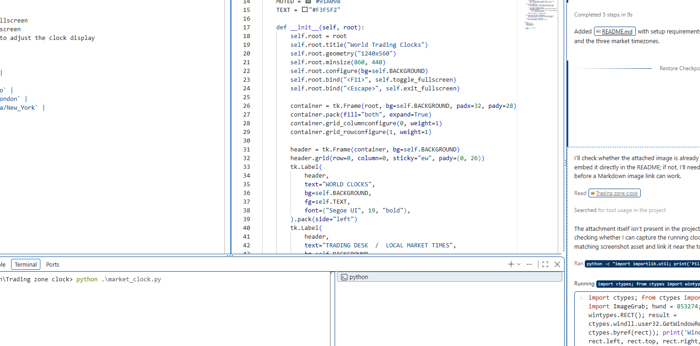

# World Trading Clocks

A small Tkinter desktop clock for keeping Tokyo, London, and New York local times visible while you trade. Each market shows a large 24-hour clock, its local date, and the current timezone abbreviation, including daylight-saving changes.



## Requirements

- Python 3.9 or newer
- Tkinter (included with most standard Python installations)
- IANA timezone data for `zoneinfo`

No third-party packages are needed when timezone data is available. On Windows, if the app reports that it cannot find timezone data, install the `tzdata` package:

```powershell
python -m pip install tzdata
```

## Run

Open PowerShell in the project folder and run:

```powershell
python market_clock.py
```

## Controls

- **F11**: Toggle fullscreen
- **Esc**: Exit fullscreen
- Resize the window to adjust the clock display

## Markets

| Market | Timezone |
| --- | --- |
| Tokyo | `Asia/Tokyo` |
| London | `Europe/London` |
| New York | `America/New_York` |
